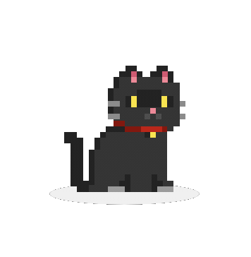

  

  <samp>
    <b>
      ソフトウェアエンジニア

 
 

  

 

    

      <samp>
        <b>More Info</b>
      </samp>
    

     

  
  
  
  
  

  

  

  
  
  
  
  
  
  
  
  
  
  
  
  
  
  
  
  
  
  
  
  

 
 

